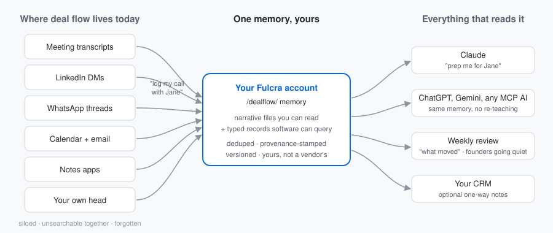

# Fulcra Dealflow Memory

Two Claude skills that give your deal flow a memory, on your own [Fulcra](https://fulcra.ai) account. Fulcra is a personal context platform: your account holds your data — calendars, files, custom records — and any AI assistant you connect to it over MCP reads and writes that same account. Each touchpoint you log — a founder conversation from first intro onward, a co-investor call, anyone in your network — is stored twice: a narrative entry you can read, and a typed record software can query. From there: sourcing recall ("what do I know about this company?"), prep before the partner meeting ("prep me for Jane"), momentum review ("what moved this week", grouped by company with stage changes per your notes), and a list of founders going quiet (45+ days). Optional one-way copy into your CRM. Because the memory lives in your account rather than inside any one chat product, it persists across sessions and across assistants.

## See it in 10 minutes — `dealflow-demo`

One guided session — about ten minutes once installed. The skill inspects your Fulcra data catalog, builds a **read-only snapshot of your last 30 days of deal flow** from whatever you've connected (calendar, meeting tools), saves it as memory on a single yes — everything versioned and reversible — and generates a prep brief from what it just stored. Nothing is written until you say so; with no sources connected, it falls back to capturing one touchpoint conversationally. Think of it as the hello-world; `dealflow-memory` below is the product.

1. Create a Fulcra account at [fulcra.ai](https://fulcra.ai) if you don't have one. An empty account is fine — the demo works without prior data.
2. In Claude, open **Customize → Connectors** and connect **Fulcra**.
3. Download `dealflow-demo.zip` from the [latest release](https://github.com/keng009/fulcra-dealflow-memory/releases/latest) (or zip the `skills/dealflow-demo` folder yourself) and upload it in Claude under **Customize → Skills → Add**. If Skills isn't visible, enable it under **Settings → Capabilities** first.
4. Start a new chat and say: **"run the Fulcra dealflow demo"**.

## Make it your workflow — `dealflow-memory`

The ongoing version: log conversations as they happen, prep before meetings, review the week by company, catch founders going quiet.

1. Same Fulcra account and connector as above.
2. Download `dealflow-memory.zip` from the [latest release](https://github.com/keng009/fulcra-dealflow-memory/releases/latest) (or zip the `skills/dealflow-memory` folder — its `references/` subfolder must travel inside the zip) and upload it the same way.
3. Say **"show me my last 30 days"**, **"log my call with Jane"**, **"seen this company before?"**, **"prep me for tomorrow"**, **"what moved this week"**, or **"who have I gone quiet on"**.

Only the Fulcra connector is required. If your Fulcra account has calendar data, the skill detects it and uses it: touchpoints get corroborated against real meetings, and "prep me for tomorrow" reads the actual calendar. If a transcript tool (Otter, Zoom, Fireflies) is connected, it can log meetings straight from transcripts. Nothing to configure — each session it states what it found and what connecting more would add.

Both skills write the same formats to the same `/dealflow/` folder in your account, so anything you logged during the demo is picked up by the full skill as-is. No migration.

## The first three exchanges

Illustrative — the companies and counts reflect your actual month; with no sources connected, the demo falls back to logging one touchpoint conversationally.

> **You:** run the Fulcra dealflow demo
>
> **Claude:** Fulcra is connected, and I can see your calendar. One minute while I read your last 30 days… Here's your snapshot — **nothing is saved yet**: **Companies seen** — Acme Ventures (3 meetings), Northstar Robotics (2), Bluefin Bio (1). **People you're spending time on** — Jane Doe (Acme) and the Northstar founders. **Loose ends** — two meetings with no follow-up note anywhere. Want me to keep this as your memory? One yes saves the clear matches — everything is versioned and reversible.
>
> **You:** Yes.
>
> **Claude:** Saved: six touchpoints across three companies — a narrative file per person plus typed records, a dedupe key on every one. Created `/dealflow/` and the **Dealflow Touchpoint** data type on the way (first run only; it didn't exist a minute ago). Reading it back for your prep brief on Jane…

The brief that follows is generated from the stored data, not from the conversation — and the snapshot itself wrote nothing until you said yes.

## What this looks like in real life

This packet is the productized version of a system the author runs on his own account every day: meeting transcripts get logged into his CRM and his Fulcra memory on a schedule; touchpoints from the channels no CRM integrates well — LinkedIn DMs, WhatsApp threads — get captured by telling Claude about them; and every assistant he uses reads the same memory. The pattern survives tool changes: switch transcript tools or CRMs and the memory stays, because it lives in your account, not a vendor's.

Illustrative output — the demo generates one of these from your own logged touchpoint:

> **Prep brief — Jane Doe (Acme Ventures)**
> **Who:** GP at Acme Ventures; intro call in August. Diligence-minded, offered their checklist unprompted.
> **Last touchpoint:** call, Aug 20 — seed co-invest discussion.
> **Stage noted (last):** evaluating — per your notes.
> **Open follow-ups:** you owe her the deck.
> **Talking points:** her diligence-checklist offer; the co-invest allocation question left open on the call.

## Make it yours

The memory is the product; these two skills are just the first things built on it. Once your touchpoints live in `/dealflow/`, extensions are one ask away — literally ask Claude:

- *"Every evening, recap today's touchpoints and what I owe people"* — an end-of-day recap.
- *"Each morning, brief me on today's meetings — pull my calendar and what my memory has on each person"* — a morning brief.
- *"Log this"* with anything pasted from Telegram, Signal, or wherever your deal flow actually happens — channels no CRM integrates.
- Point a second assistant at the same account — your ChatGPT reads the same files Claude writes.

None of these require changing the skills: the data contract is [documented](skills/dealflow-memory/references/conventions.md), and anything that can read your Fulcra account can build on it.

## Already have a CRM?

Keep it. Your CRM is not copied into Fulcra: the memory holds the relationships you actually touch — the people you've met with in the last month or two, growing as you work — not a mirror of thousands of contacts. Breadth questions ("do we know anyone at Acme?") belong to your CRM, which already answers them; the memory answers the questions your CRM can't, about the conversations you actually had. If your Claude has CRM tools connected, `dealflow-memory` offers — once per session, never requires — to copy each logged touchpoint the *other* way, into the CRM as a note on the matched contact, with follow-ups as tasks where the CRM supports them. The sync is one-way, Fulcra → CRM, notes and tasks only: it never creates contacts and never edits fields, stages, or amounts, so your CRM stays the system of record for pipeline. Logging the same touchpoint twice can't duplicate notes — every note title ends with a deterministic key, and the skill scans the contact's existing note titles before writing. Tested with Attio ([test record](docs/testing.md)). Notion and Affinity have official read/write connectors and should work — if you try one, tell us by opening an issue. HubSpot's official Claude connector is read-only, so HubSpot sync only works if you connect a separate write-capable HubSpot MCP server. No CRM connected? The skill never mentions one.

## What this demonstrates

Each row is behavior you can watch one of the two skills perform, mapped to the Fulcra capability it runs on.

| What the skill does | Fulcra capability |
|---|---|
| Opens by naming data your account already holds — sleep, calendars, existing custom types — before writing anything | Data catalog (`get_data_catalog`): agents inspect what an account contains instead of assuming |
| Shows your last 30 days of deal flow before storing anything, then saves it all on one yes | Read-only analysis over connected sources; versioned files and soft deletes make the batch commit fully reversible |
| Keeps one narrative file per person under `/dealflow/relationships/`; updating a file creates a new version rather than destroying the old one, and deletes are soft | Versioned file store (`list_files`, `read_file`, `write_file`) |
| Creates a `Dealflow Touchpoint` data type live in your account, then logs one typed record per touchpoint — the records the "what moved this week" report queries | Custom data types whose records carry structured JSON payloads (`create_data_type`, `record_data`, `get_records`) |
| Ends the demo by pointing you at the same data in your Fulcra portal and suggesting you ask another connected assistant — ChatGPT, say — "what do you know about Jane?" | Cross-assistant memory: every assistant connected to the account over MCP reads the same files and records |
| Scans for a deterministic dedupe key before every write — relationship file and CRM alike — and stamps every touchpoint entry and typed record with a provenance suffix (producer, evidence, timestamp) | The agent patterns explored in [fulcra-for-agents](https://github.com/kubla/fulcra-for-agents): repetition tolerance, derived context |

The data contract behind all of it — file formats, dedupe keys, the record schema, the provenance rule — is written once, in [`skills/dealflow-memory/references/conventions.md`](skills/dealflow-memory/references/conventions.md). Both skills conform to it.

## Privacy

These skills are instruction files: they add no backend of their own — no author-operated server, no telemetry, no analytics, and nothing that reports back to the authors. Your requests are still processed by Claude and by Fulcra's hosted service under their own terms and privacy policies. The skills write to exactly two places in your Fulcra account: files under the `/dealflow/` folder, and typed records in the account-level **Dealflow Touchpoint** data type they create — plus, only if you accept the offer, notes in your own CRM. Outside those they only read, and only what the features need: your data-catalog listing (to show you what your account holds), your calendar if connected (to corroborate touchpoints and prep tomorrow), and your timezone. If you accept CRM sync, they also search your CRM's contacts and read existing note titles to dedupe; if you log from a transcript tool, they read the transcripts you pick. They never write credentials, tokens, or secrets to any file, and they never send email or messages on your behalf: ask for a follow-up and you get a clearly labeled draft. File deletes in Fulcra are soft, so removing the demo's sample file is reversible; the sample typed record has no per-record delete through the connector — the demo tells you this **before** offering sample data — and sits inert, clearly labeled.

---

MIT — see [LICENSE](LICENSE). Maintained by Nick Kengmana, Fulcra.
